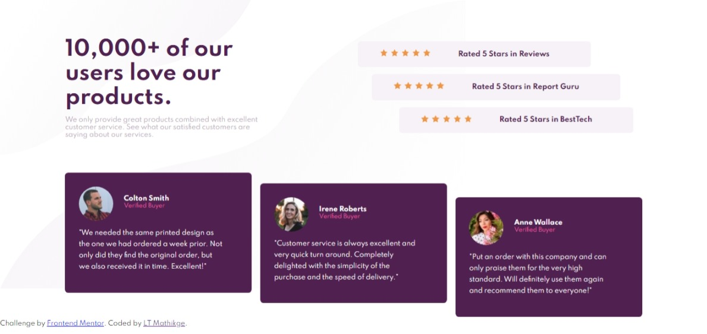
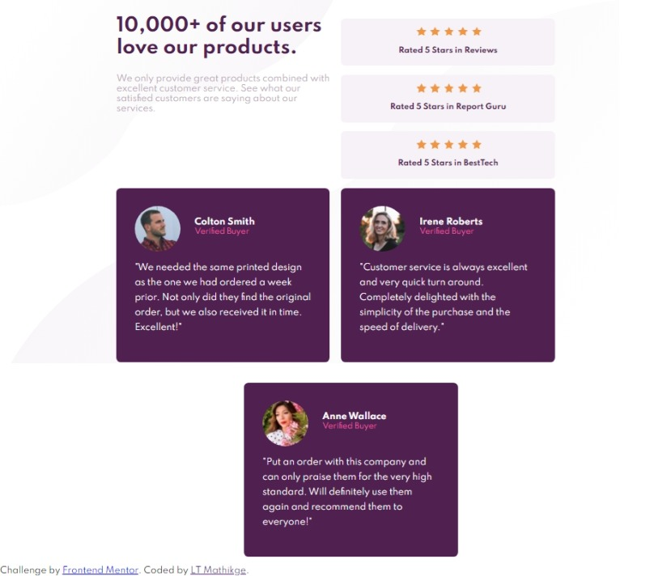
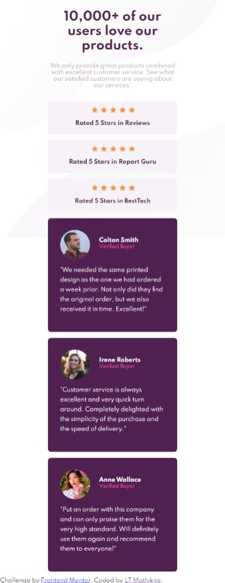

# Frontend Mentor - Social proof section

## Welcome! 👋

Thanks for checking out this front-end coding challenge.

## Table of contents

- [Overview](#overview)
  - [The challenge](#the-challenge)
  - [Screenshot](#screenshot)
  - [Links](#links)
- [My process](#my-process)
  - [Built with](#built-with)
  - [What I learned](#what-i-learned)
  - [Continued development](#continued-development)
  - [Useful resources](#useful-resources)
- [Author](#author)
- [Acknowledgments](#acknowledgments)

## Overview

## The challenge

Your challenge is to build out this social proof section and get it looking as close to the design as possible.

Your users should be able to:

- View the optimal layout for the section depending on their device's screen size

### Screenshot

### Links

- Solution URL: [https://www.frontendmentor.io/solutions/social-proof-section-using-grid-and-flexbox-AslahwljD](https://www.frontendmentor.io/solutions/social-proof-section-using-grid-and-flexbox-AslahwljD)
- Live Site URL: [https://lt-dev-tag-house.github.io/Social_Proof/](https://lt-dev-tag-house.github.io/Social_Proof/)

## My process

### Built with

- Semantic HTML5 markup
- CSS custom properties
- Flexbox
- Grid
- Mobile-first workflow

### What I learned

For this challenge I got to practice using Grid and careful implementation of the HTML Markup.

Frontend Mentor always has good challenge designs to build, this was also another good design challenge for me. Key takeaways for this challenge:
- HTML Markup structure **critical**
- Switching between Flexbox and Grid on uses cases I encountered, i.e. I applied Flexbox for card image and card name. Used grid on desktop view for separating the header section and the raitings section.
- As a Frontend developer one needs to be able to pay close attention to the details of the design spec provided and do absolute best to re-produce the same design.

**My approach**
- Build the mock-up with the mobile-design approach.
- Markout sections on the design that will be broken down into my HTML Markup
- Setup basic styles to be used for my typography.

**My challenges**
- Making the card image sizes smaller as per design spec - I still did not manage with this.
- Applying background images.
- Creating a responsive page across different devices. (This was much easier on my second attempted after actually planning my HTML markup on paper.)

**Final takeaway**
- Definitely more practice in doing the challenges to get a good hang of building the designs.
- This challenge showed me how reponsive design becomes very easy once your HTML mark-up has been created correctly.
- I'm happy on the outcome - there is always room for improvement and I undertake to check other peoples solutions and see how they approached doing this challenge.

### Continued development

- Accessibility
- Media queries 
- CSS Properties: vw, vh etc.

### Useful resources

- CSS GRID by WES BOS [https://cssgrid.io/](https://cssgrid.io/)
- CSS GRID by Tom Duffy [https://tomduffytech.com/](https://tomduffytech.com/)

## Author

- Frontend Mentor - [@LT-WebDev](https://www.frontendmentor.io/profile/LT-WebDev)
- Twitter - [@IAM_letlotlo_](https://www.twitter.com/IAM_letlotlo_)

**Amazing building this challenge!** 🚀
